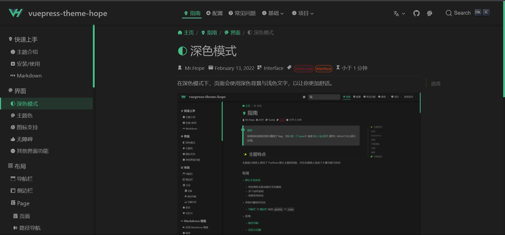

在深色模式下，页面会使用深色背景与浅色文字，以保护你的眼睛。

<!-- more -->

## 选项

你可以通过 `themeConfig.darkmode` 来配置深色模式

可选的值:

- `'auto-switch'`: "关闭 | 自动 | 打开" 的三段式开关 (默认)
- `'switch'`: "关闭 | 打开" 的切换式开关
- `'auto'`: 自动根据用户设备主题或当前时间决定是否应用深色模式
- `'disable'`: 禁用深色模式
