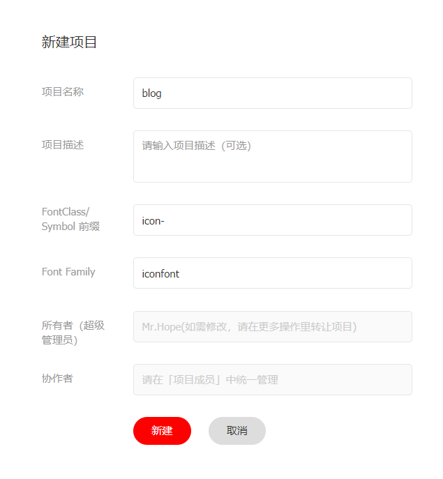
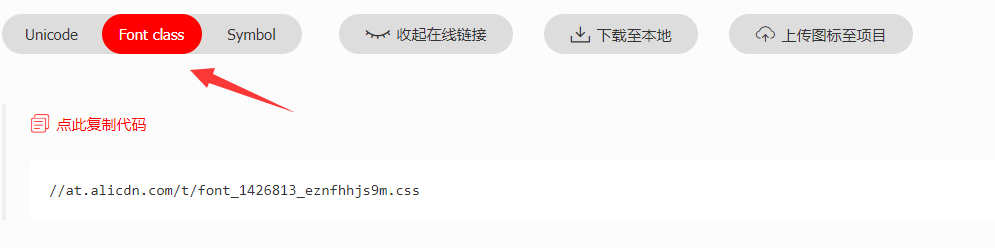

整个主题在多处都添加了 FontClass / 图片 格式图标的支持。

目前你可以使用 iconfont、iconify 和 fontawesome 为你的项目添加图标，可以设置自己的图标资源。

同时，png/svg 格式的图标也是支持的。你可以使用完整 URL 或路径名来添加图标。

我们推荐使用 iconify 或 fontawesome。

<!-- more -->

## 浏览图标

- Iconify: <https://icon-sets.iconify.design/>
- Iconfont: <https://www.iconfont.cn/>
- Fontawesome: <https://fontawesome.com/icons>

::: details iconfont 关键词精选图标

<IconDisplay link="//at.alicdn.com/t/c/font_2410206_5vb9zlyghj.css" />

:::

## 设置图标

你可以在多个地方使用图标。

- 页面: 在 frontmatter 中设置 `icon`

  此图标将用于路径导航、页面标题、导航栏生成项、侧边栏生成项、页面导航等。

- 导航栏: 在 NavbarItemConfig 中设置 `icon` 选项

- 侧边栏: 在 SidebarItemConfig 中设置 `icon` 选项

- 主页: 在功能项中设置 `icon` 选项

## 在 Markdown 中添加图标

你可以使用 `<HopeIcon />` 组件在 markdown 中添加图标。

- `icon` 属性接受与其他 `icon` 选项相同的内容，即：字体类名和图像 url
- `color` 属性接受一个 css 颜色值，它将用作图标颜色（可选）
- `size` 属性接受一个 css 大小值，该值将用作图标大小（可选）

::: details 案例

- <HopeIcon icon="home" color="red" />
- <HopeIcon icon="//theme-hope-assets.vuejs.press/logo.svg" size="4rem" />

```MD
- <HopeIcon icon="home" color="red" />
- <HopeIcon icon="//theme-hope-assets.vuejs.press/logo.svg" size="4rem" />
```

:::

## 全局设置

你可以通过 `iconAssets` 和 `iconPrefix` 全局设置图标资源 url 和图标前缀。

### 设置图标资源

你应该将图标相关资源设置为 `iconAssets`，你可以在其中设置：

- 图标资源关键词
- css 和 js 格式的图标资源
- 以上项目的数组

::: code-tabs#language

@tab TS

```ts {8}
// .vuepress/config.ts
import { defineUserConfig } from "vuepress";
import { hopeTheme } from "vuepress-theme-hope";

export default defineUserConfig({
  theme: hopeTheme({
    // 关键词: "iconfont", "iconify", "fontawesome", "fontawesome-with-brands"
    iconAssets: "fontawesome",

    // 你想要的 URL
    iconAssets: "/base/my/font-icon/resource.js",

    // 上述内容的数组
    iconAssets: [
      "/base/my/font-icon/resource.js",
      "https://example/my/fonr-icon/resouce.css",
      "fontawesome",
    ],
  }),
});
```

@tab JS

```js {8}
// .vuepress/config.ts
import { defineUserConfig } from "vuepress";
import { hopeTheme } from "vuepress-theme-hope";

export default defineUserConfig({
  theme: hopeTheme({
    // 关键词: "iconfont", "iconify", "fontawesome", "fontawesome-with-brands"
    iconAssets: "fontawesome",

    // 你想要的 URL
    iconAssets: "/base/my/font-icon/resource.js",

    // 上述内容的数组
    iconAssets: [
      "/base/my/font-icon/resource.js",
      "https://example/my/fonr-icon/resouce.css",
      "fontawesome",
    ],
  }),
});
```

:::

例如，你可以使用 [iconfont.cn](https://www.iconfont.cn/) 和 [fontawesome](https://fontawesome.com) 来生成你自己的资源

为了便于上手，我们添加了内置关键字 `"iconfont"`、`"iconify"`、`"fontawesome"` 和 `"fontawesome-with-brand` 支持。

::: caution

如果你将此插件用于商业项目文档，则**不推荐**使用 iconfont，因为 iconfont 本身是设计人员和开发人员的学习/共享平台。

每个图标都是用户上传的，你必须获得作者的授权才能用于商业用途。上传者也有可能违背用户协议，上传版权在第三方的非原创图标。

:::

### 设置图标前缀

`iconPrefix` 是你要设置的图标前缀，

通常，你的图标类应该有一个通用前缀，对于 `iconfont`，图标类名为`iconfont icon-<ICON-NAME>`，对于 fontawesome free，图标类名为 `fas fa-<icon-name>`。 因此，当你使用关键字或从 iconfont 网站、fontawesome kit 或 fontawesome CDN 生成的单个链接设置上述 `asset` 选项时，插件会识别它们并自动为你设置前缀为 `iconfont icon-` 和 `fas fa-`.

在你使用自己的 url 或设置多个 url 的其他情况下，你可以自己手动设置此选项。毕竟输入 `icon: apple` 总是比 `icon: iconfont icon-apple`、`icon: mdi:apple` 或 `icon: fa-solid fa-apple` 更好。

## 高级

### 使用 Fontawesome Kit

你可以在 [fontawesome.com](https://fontawesome.com) 购买使用套件。

具有专业功能的 Fontawesome 工具包支持专业图标、更多图标样式和上传你自己的图标。

::: note

详情请关注 [fontawesome 文档](https://fontawesome.com/)。

- [使用说明](https://fontawesome.com/docs/web/add-icons/how-to)
- [图标列表](https://fontawesome.com/icons)

:::

### 生成自己的 Iconfont 资源

[Iconfont](https://iconfont.cn) 是阿里妈妈 MUX 倾力打造的矢量图标管理、交流平台。

设计师将图标上传到 Iconfont 平台，用户可以自定义下载多种格式的 icon，平台也可将图标转换为字体，便于前端工程师自由调整与调用。

#### 使用方式

首先你需要新建一个项目，对你网站的图标进行设置与管理:

1. 使用 GitHub 或微博登录 Iconfont。
1. 在网站上方找到 “资源管理 → 我的项目”，点击右上角的 “新建项目” 图标。
1. 设置可以辨识的项目名称
1. `FontClass/Symbol 前缀` 填入 `icon-` (你也可以根据自己喜好填写，但需要将此值设置额外前缀 `iconfont` 并设置到在主题选项中的 `iconPrefix`)
1. Font Family 请保持 `iconfont`



#### 导入图标

1. 请自行在 iconfont 自由搜索寻找你想要使用的图标，并点击图标上的 “添加入库” 按钮

   

1. 在寻找完所有图标后，请点击右上角的 “添加入库” 图标，点击下方的 “添加至项目” 并选择你刚刚创建好的项目进行确定。

#### 编辑图标

在项目页面，你可以对项目内的图标进行简单的编辑，包括位置、缩放、旋转、颜色以及 Unicode 编号与 Font Class / Symbol 的调整。


#### 生成图标文件

1. 请点击项目上方的 “Font Class” 按钮，并点击生成。

   

1. 将 css 地址设置到主题选项的 `iconAssets` 中。

#### 提示

::: tip

如果你日后添加了新的图标，请重新生成新的 CSS 地址并替换 `iconAssets`。

:::

::: warning 私有字符冲突

字体图标将每个图标与 unicode 私有字符范围内的一个字符相关联，iconfont 使用的字符是随机的。

如果新图标的默认字符已在当前项目中使用，iconfont 将尝试通过分配新字符来解决冲突，但不同的项目可能会发生冲突。

所以我们不建议你使用多个 iconfont 链接作为资源，如果你准备这样做，请检查图标以确保每个先前的项目图标都不会被后来的图标覆盖。

:::

<script setup lang="ts">
import IconDisplay from "@IconDisplay";
import HopeIcon from "@theme-hope/components/HopeIcon";
</script>
