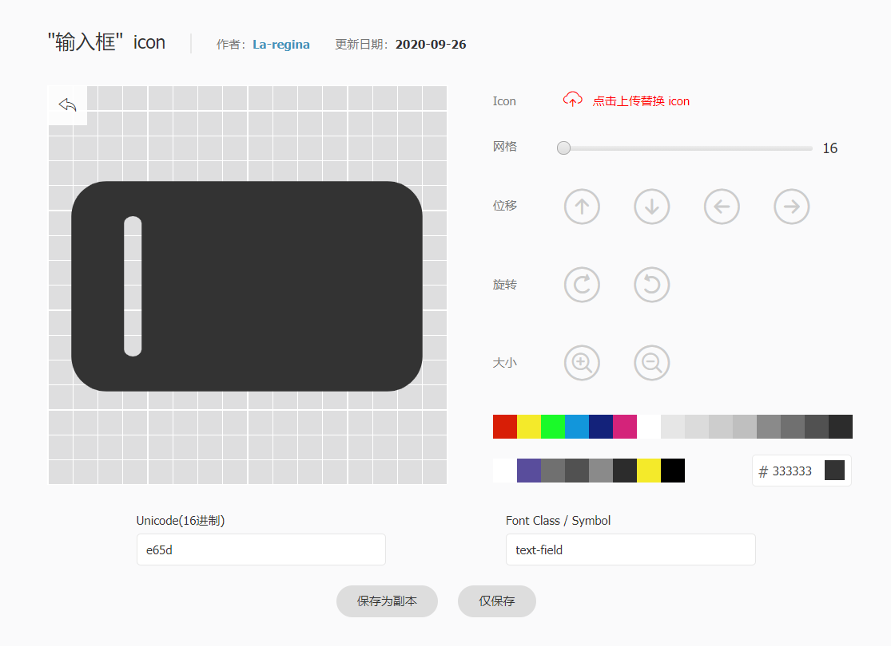

整个主题在多处都添加了 FontClass 格式图标的支持。

目前你可以使用 iconfont 和 fontawesome 为你的项目添加图标。

- 对于国内用户，推荐使用 iconfont
- 对于海外用户，推荐使用 fontawesome

::: info

图标 class 的前缀默认为空，你很可能需要按照自己的选择通过主题配置中的 `iconPrefix` 选项来更改它。

:::

<!-- more -->

## 设置图标

按照下方说明导入图标并设置 `iconPrefix` 后，你可以在多个地方使用图标。

- 页面: 在 frontmatter 中设置 `icon`

  此图标将用于路径导航、页面标题、导航栏生成项、侧边栏生成项、页面导航等。

- 导航栏: 在 NavbarItemConfig 中设置 `icon` 选项
- 侧边栏: 在 SidebarItemConfig 中设置 `icon` 选项
- 主页: 在功能项中设置 `icon` 选项

## Iconfont

[Iconfont](https://iconfont.cn) 是阿里妈妈 MUX 倾力打造的矢量图标管理、交流平台。

设计师将图标上传到 Iconfont 平台，用户可以自定义下载多种格式的 icon，平台也可将图标转换为字体，便于前端工程师自由调整与调用。

### 使用方式

首先你需要新建一个项目，对你网站的图标进行设置与管理:

1. 使用 GitHub 或微博登录 Iconfont。
1. 在网站上方找到 “资源管理 → 我的项目”，点击右上角的 “新建项目” 图标。
1. 设置可以辨识的项目名称
1. `FontClass/Symbol 前缀` 填入 `icon-`(你也可以根据自己喜好填写，但需要将此值设置额外前缀 `iconfont` 并设置到 `themeConfig.iconPrefix`)
1. Font Family 请保持 `iconfont`


### 导入图标

1. 请自行在 iconfont 自由搜索寻找你想要使用的图标，并点击图标上的 “添加入库” 按钮

   

1. 在寻找完所有图标后，请点击右上角的 “添加入库” 图标，点击下方的 “添加至项目” 并选择你刚刚创建好的项目进行确定。

### 编辑图标

在项目页面，你可以对项目内的图标进行简单的编辑，包括位置、缩放、旋转、颜色以及 Unicode 编号与 Font Class / Symbol 的调整。



### 生成图标文件

1. 请点击项目上方的 “Font Class” 按钮，并点击生成。

   

1. 在 VuePress 配置的 `head` 选项中引入 CSS:

   ```js
   [
     "link",
     {
       rel: "stylesheet",
       href: "//at.alicdn.com/t/font_2410206_mfj6e1vbwo.css",
     },
   ];
   ```

::: tip

如果你日后添加了新的图标，请重新生成新的 CSS 地址并在 `head` 选项中替换。

:::

## Fontawesome

本主题内置了 Fontawesome 支持。

### 导入

你可以在站点配置中的 `head` 添加:

```js
[
  "script",
  {
    src: "https://kit.fontawesome.com/ca37c296c5.js",
    crossorigin: "anonymous",
  },
];
```

或者在 `.vuepress/styles` 的 `index.scss` 的顶部添加:

```scss
@import url("https://cdnjs.cloudflare.com/ajax/libs/font-awesome/6.0.0/css/regular.min.css");
```

::: note

Font-awesome 当前版本为 6.0.0

:::

同时你需要将 `themeConfig.iconPrefix` 设置为 `"fas fa-"`。

### 使用

请按照 [fontawesome 文档](https://fontawesome.com/) 正常使用。

- [使用说明](https://fontawesome.com/docs/web/add-icons/how-to)
- [图标列表](https://fontawesome.com/icons)

## Iconfont 精选图标

```html
<link rel="stylesheet" href="//at.alicdn.com/t/font_2410206_mfj6e1vbwo.css" />
```

<IconDisplay link="//at.alicdn.com/t/font_2410206_mfj6e1vbwo.css" />

<script setup lang="ts">
import IconDisplay from '@IconDisplay';
</script>
