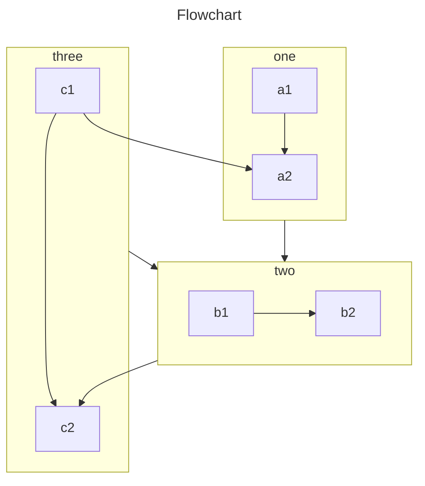

VuePress 主要从 Markdown 文件生成页面。因此，你可以使用它轻松生成文档或博客站点。

你应该创建和编写 Markdown 文件，以便 VuePress 可以根据文件结构将它们转换为不同的页面。

<!-- more -->

```component VPBanner
title: Markdown 介绍
content: 如果你是一个新手，还不会编写 Markdown，请先阅读下方板块。
logo: /assets/image/markdown.svg
background: var(--bg-2)
color: var(--banner-text)
actions:
  - text: Markdown 教程
    link: ../../cookbook/markdown/
```

## Markdown 配置

VuePress 通过 Frontmatter 为每个 Markdown 页面引入配置。

::: info

Frontmatter 是 VuePress 中很重要的一个概念，如果你不了解它，你需要阅读 [Frontmatter 介绍](../../cookbook/vuepress/page.md#frontmatter)。

:::

## Markdown 扩展

VuePress 会使用 [markdown-it](https://github.com/markdown-it/markdown-it) 来解析 Markdown 内容，因此可以借助于 markdown-it 插件来实现 [语法扩展](https://github.com/markdown-it/markdown-it#syntax-extensions) 。

### VuePress 扩展

为了丰富文档写作，VuePress 对 Markdown 语法进行了扩展。

关于这些扩展，请阅读 [内置 Markdown 扩展](../../cookbook/vuepress/markdown.md)。

### 主题扩展

通过 <ProjectLink name="md-enhance" path="/zh/">`vuepress-plugin-md-enhance`</ProjectLink>，主题扩展了更多 Markdown 语法，提供更加丰富的写作功能。

#### 提示容器

::: v-pre

安全的在 Markdown 中使用 {{ variable }}。

:::

::: info 自定义标题

信息容器，包含 `代码` 与 [链接](#提示容器)。

```js
const a = 1;
```

:::

::: tip 自定义标题

提示容器

:::

::: warning 自定义标题

警告容器

:::

::: caution 自定义标题

危险容器

:::

::: details 自定义标题

详情容器

:::

:::: details 代码

```md
::: v-pre

安全的在 Markdown 中使用 {{ variable }}。

:::

::: info 自定义标题

信息容器

:::

::: tip 自定义标题

提示容器

:::

::: warning 自定义标题

警告容器

:::

::: caution 自定义标题

危险容器

:::

::: details 自定义标题

详情容器

:::
```

::::

- [查看详情](../markdown/hint.md)

#### 选项卡

::: tabs#fruit

@tab apple

Apple

@tab banana

Banana

@tab orange

Orange

:::

- [查看详情](../markdown/tabs.md)

#### 代码块

::: code-tabs

@tab yarn

```bash
yarn add -D vuepress-theme-hope
```

@tab:active npm

```bash
npm i -D vuepress-theme-hope
```

:::

- [查看详情](../markdown/code-tabs.md)

#### 自定义对齐

::: center

我是居中的

:::

::: right

我是右对齐

:::

- [查看详情](../markdown/align.md)

#### 属性支持

一个有 id 的 **单词**{#word}。

- [查看详情](../markdown/attrs.md)

#### 上下角标

19^th^ H~2~O

- [查看详情](../markdown/sup-sub.md)

#### 脚注

此文字有脚注[^first].

[^first]: 这是脚注内容

- [查看详情](../markdown/footnote.md)

#### 标记

你可以标记 ==重要的内容== 。

- [查看详情](../markdown/mark.md)

#### 任务列表

- [x] 计划 1
- [ ] 计划 2

- [查看详情](../markdown/tasklist.md)

#### 图片增强

支持为图片设置颜色模式和大小

- [查看详情](../markdown/image.md)

#### 图表

::: chart 一个散点图案例

```json
{
  "type": "scatter",
  "data": {
    "datasets": [
      {
        "label": "散点数据集",
        "data": [
          { "x": -10, "y": 0 },
          { "x": 0, "y": 10 },
          { "x": 10, "y": 5 },
          { "x": 0.5, "y": 5.5 }
        ],
        "backgroundColor": "rgb(255, 99, 132)"
      }
    ]
  },
  "options": {
    "scales": {
      "x": {
        "type": "linear",
        "position": "bottom"
      }
    }
  }
}
```

:::

- [查看详情](../markdown/chartjs.md)

#### Echarts

::: echarts 一个折线图案例

```json
{
  "xAxis": {
    "type": "category",
    "data": ["Mon", "Tue", "Wed", "Thu", "Fri", "Sat", "Sun"]
  },
  "yAxis": {
    "type": "value"
  },
  "series": [
    {
      "data": [150, 230, 224, 218, 135, 147, 260],
      "type": "line"
    }
  ]
}
```

:::

- [查看详情](../markdown/echarts.md)

#### 流程图

```flow
cond=>condition: 是否执行操作?
process=>operation: 操作
e=>end: 结束

cond(yes)->process->e
cond(no)->e
```

- [查看详情](../markdown/flowchart.md)

#### Mermaid



- [查看详情](../markdown/mermaid.md)

#### Tex 语法

$$
\frac {\partial^r} {\partial \omega^r} \left(\frac {y^{\omega}} {\omega}\right)
= \left(\frac {y^{\omega}} {\omega}\right) \left\{(\log y)^r + \sum_{i=1}^r \frac {(-1)^i r \cdots (r-i+1) (\log y)^{r-i}} {\omega^i} \right\}
$$

- [查看详情](../markdown/tex.md)

#### 导入文件

<!-- @include: ../markdown/demo.snippet.md{9-13} -->

- [查看详情](../markdown/include.md)

#### 代码演示

::: normal-demo 一个普通 Demo

```html
<h1>VuePress Theme Hope</h1>
<p><span id="very">非常</span>强大!</p>
```

```js
document.querySelector("#very").addEventListener("click", () => {
  alert("非常强大");
});
```

```css
span {
  color: red;
}
```

:::

- [查看详情](../markdown/demo.md)

#### 样式化

设置它<span style="color:red">没有</span>任何效果，请<span style="color:red">不要</span>这样使用

- [查看详情](../markdown/stylize.md)

### 交互演示

::: playground#ts TS 案例

@file index.ts

```ts
const msg = "hello world";

const speak = (msg: string) => console.log(msg);

speak(msg);
```

:::

- [查看详情](../markdown/playground.md)

### Kotlin 交互演示

::: kotlin-playground Kotlin 交互演示

@file main.kt

```kotlin
class Contact(val id: Int, var email: String)

fun main(args: Array<String>) {
    val contact = Contact(1, "mary@gmail.com")
    println(contact.id)
}
```

:::

- [查看详情](../markdown//kotlin-playground.md)

### Vue 交互演示

::: vue-playground Vue 交互演示

@file App.vue

```vue
<script setup>
import { ref } from "vue";

const msg = ref("Hello World!");
</script>

<template>
  <h1>{{ msg }}</h1>
  <input v-model="msg" />
</template>
```

:::

- [查看详情](../markdown/vue-playground.md)

#### 幻灯片

@slidestart

## 幻灯片 1

一个有文字和 [链接](https://mister-hope.com) 的段落

---

## 幻灯片 2

- 项目 1
- 项目 2

---

## 幻灯片 3.1

```js
const a = 1;
```

--

## 幻灯片 3.2

$$
J(\theta_0,\theta_1) = \sum_{i=0}
$$

@slideend

- [查看详情](../markdown/revealjs.md)

- [查看详情](../markdown/stylize.md)
