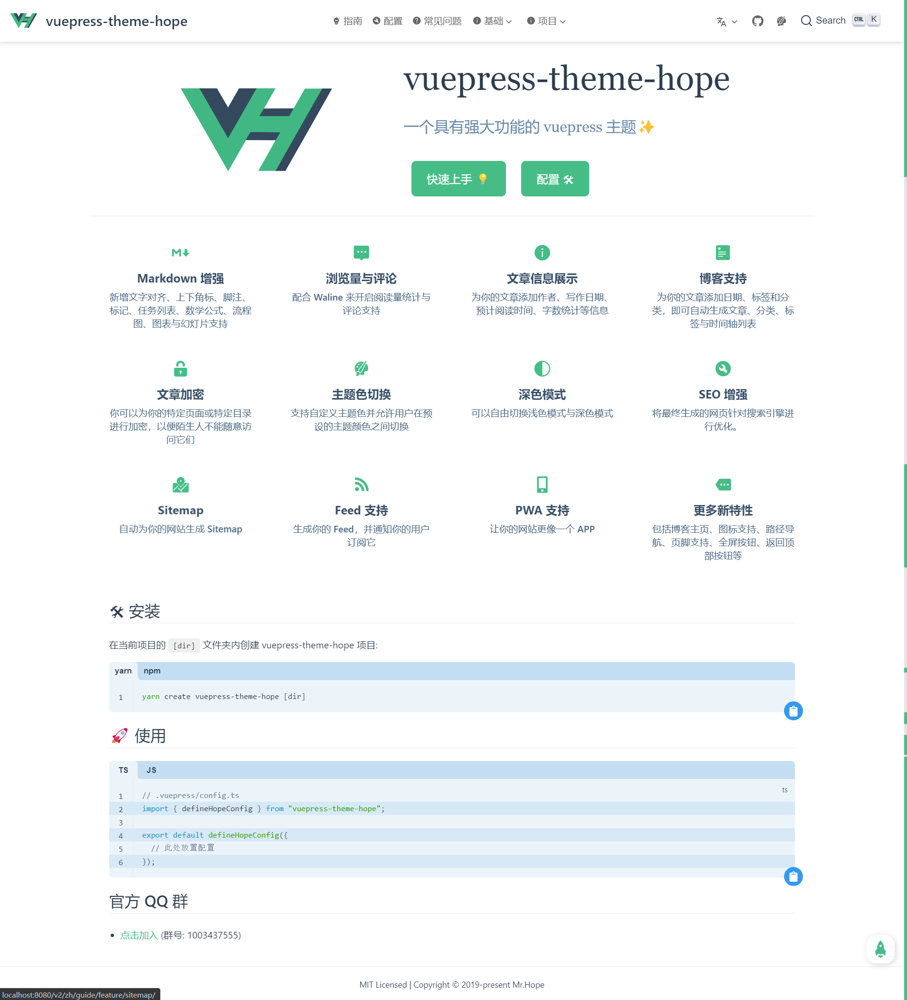

# 首页

`vuepress-theme-hope` 对首页布局进行了一些改进。

如果想要使用它，请在 frontmatter 中设置 `home: true`。任何 `YAML front matter` 之后额外的内容将会以普通的 Markdown 被渲染，并插入到 `features` 的后面。



## 配置选项

可以配置的 frontmatter 参数如下:

### home

- 类型: `boolean`

设置为 `true` 时启用首页样式

### title

- 类型: `string | false`
- 默认值: `'Hello'`

标题，填入 `false` 会取消显示。

### heroImage

- 类型: `string`

主页图标 (logo) 地址，需要填入绝对路径 (图片需要放入 `.vuepress/public` 文件夹)

### darkHeroImage

- 类型: `string`

深色模式下主页图标 (logo) 地址，需要填入绝对路径 (图片需要放入 `.vuepress/public` 文件夹)，默认同 `heroImage`。

### heroText

- 类型: `string`

主页图标替代文字。

### tagline

- 类型: `string`
- 默认值: `'Welcome to your VuePress site'`

附加文字描述

### action

- 类型: `ActionConfig | ActionConfig[]`

`ActionConfig` 结构:

- `text`: 按钮文字
- `tink`: 按钮链接

### features

- 类型: `Feature[]`

`Feature` 结构:

- `title`: `string` 标题
- `details`: `string` 详情
- `link`(可选): `string` 链接地址

特性说明

## 配置案例

```yaml
---
home: true
title: vuepress-theme-hope
icon: home
heroImage: /logo.svg
heroText: vuepress-theme-hope
tagline: 一个具有强大功能的 vuepress 主题✨
action:
  - text: 快速上手 💡
    link: /zh/guide/
    type: primary

  - text: 配置 🛠
    link: /zh/config/

features:
  - title: 浏览量与评论
    details: 配合 Valine 与 Vssue 来开启阅读量统计与评论支持
    link: /zh/guide/feature/comment/

  - title: 文章信息展示
    details: 为你的文章添加作者、写作日期、预计阅读时间、字数统计等信息
    link: /zh/guide/feature/page-info/

  - title: Markdown 增强
    details: 新增文字对齐、上下角标、脚注、标记、数学公式与流程图支持
    link: /zh/guide/feature/markdown/

  - title: 博客支持
    details: 为你的文章添加日期、标签和分类，即可自动生成文章、分类、标签与时间轴列表
    link: /zh/guide/feature/blog/

  - title: 文章加密
    details: 你可以为你的特定页面或特定目录进行加密，以便陌生人不能随意访问它们
    link: /zh/guide/feature/encrypt/

  - title: 主题色切换
    details: 支持自定义主题色并允许用户在预设的主题颜色之间切换
    link: /zh/guide/feature/themecolor/#自定义主题色

  - title: 深色模式
    details: 可以自由切换浅色模式与深色模式
    link: /zh/guide/feature/themecolor/#深色模式

  - title: Sitemap 生成与 SEO 增强
    details: 主题可以自动为你的网站生成 Sitemap，并将最终生成的网页针对搜索引擎进行优化。
    link: /zh/guide/feature/seo-sitemap/

  - title: 更多新特性
    details: 包括博客主页、图标支持、路径导航、页脚支持、全屏按钮、返回顶部按钮等
    link: /zh/guide/feature/

  - title: PWA 支持
    details: 内置的 PWA 插件会让你的网站更像一个 APP。
    link: /zh/guide/feature/pwa/

  - title: TS 支持
    details: 为你的 VuePress 开启 TypeScript 支持
    link: /zh/guide/feature/typescript/

footer: MIT Licensed | Copyright © 2019-present Mr.Hope
copyrightText: false
---

```
