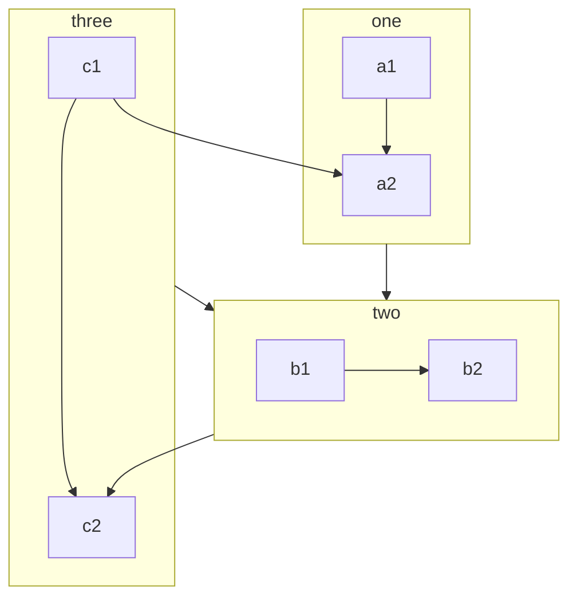

## 新增的更多语法

### 自定义对齐

::: center

我是居中的

:::

::: right

我在右对齐

:::

- [查看详情](align.md)

### 上下角标

19^th^ H~2~O

- [查看详情](sup-sub.md)

### 脚注

此文字有脚注[^first].

[^first]: 这是脚注内容

- [查看详情](footnote.md)

### 标记

你可以标记 ==重要的内容== 。

- [查看详情](mark.md)

### 任务列表

- [x] 计划 1
- [ ] 计划 2

- [查看详情](tasklist.md)

### 流程图

```flow
cond=>condition: Process?
process=>operation: Process
e=>end: End

cond(yes)->process->e
cond(no)->e
```

- [查看详情](flowchart.md)

### Mermaid 图表



- [查看详情](mermaid.md)

### Tex 语法

$$
\frac {\partial^r} {\partial \omega^r} \left(\frac {y^{\omega}} {\omega}\right)
= \left(\frac {y^{\omega}} {\omega}\right) \left\{(\log y)^r + \sum_{i=1}^r \frac {(-1)^i r \cdots (r-i+1) (\log y)^{r-i}} {\omega^i} \right\}
$$

- [查看详情](tex.md)

### 代码演示

::: demo 一个普通 Demo

```html
<h1>Mr.Hope</h1>
<p><span id="very">十分</span> 帅</p>
```

```js
document.querySelector("#very").addEventListener("click", () => {
  alert("十分帅");
});
```

```css
span {
  color: red;
}
```

:::

- [查看详情](demo.md)

### 幻灯片

@slidestart

## 幻灯片 1

一个有文字和 [链接](https://mrhope.site) 的段落

---

## 幻灯片 2

- 项目 1
- 项目 2

---

## 幻灯片 3.1

```js
const a = 1;
```

--

## 幻灯片 3.2

$$
J(\theta_0,\theta_1) = \sum_{i=0}
$$

@slideend

- [查看详情](presentation/readme.md)
